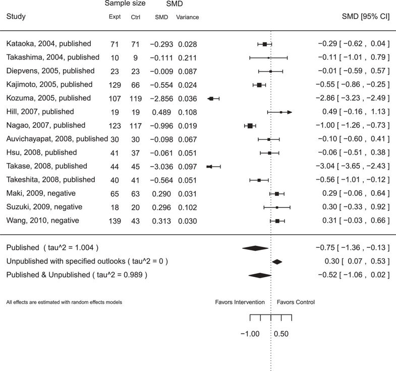

# R-samurai-public

# SAMURAI, an R package

A visualization tool for systematic reviewers gauging how much a meta-analysis of published clinical trial results may (1) change with the inclusion of results from unpublished studies and/or (2) remain biased by the exclusion of unpublished results.

## Example 

Below is a forest plot for the dataset _greentea_ (included with this R package) which includes 14 studies registered with  [clinicaltrials.gov](clinicaltrials.gov). Of these, 11 are denoted as 'published' and the other 3 are denoted as 'unpublished' (for the purpose of demonstration). All 3 'unpublished' studies were assigned ‘negative’ outcomes. 

The standardized mean differences (SMD) are generated using the DerSimonian-Laird method.

## Software

[CRAN repository](https://CRAN.R-project.org/package=SAMURAI)  (Inactive link)

(Currently archived: https://cran.r-project.org/src/contrib/Archive/SAMURAI/)

## Journal article

[Systematic Reviews journal article](https://doi.org/10.1186/2046-4053-3-27)

## Online version with preset data sets

[R Shiny app](https://noory.shinyapps.io/samurai_example/)

### Citation

Kim NY, Bangdiwala SI, Thaler K, Gartlehner G. 2014. "SAMURAI: Sensitivity analysis of a meta-analysis with unpublished but registered analytical investigations" _Systematic Reviews_ 2014 Mar 18; **3**:27. doi: 10.1186/2046-4053-3-27

### Abstract

Background: The non-availability of clinical trial results contributes to publication bias, diminishing the validity of systematic reviews and meta-analyses. Although clinical trial registries have been established to reduce non-publication, the results from over half of all trials registered in ClinicalTrials.gov remain unpublished even 30 months after completion. Our goals were i) to utilize information available in registries (specifically, the number and sample sizes of registered unpublished studies) to gauge the sensitivity of a meta-analysis estimate of the effect size and its confidence interval to the non-publication of studies and ii) to develop user-friendly open-source software to perform this quantitative sensitivity analysis.

Methods: The open-source software, the R package SAMURAI, was developed using R functions available in the R package metafor. The utility of SAMURAI is illustrated with two worked examples.

Results: Our open-source software SAMURAI, can handle meta-analytic datasets of clinical trials with two independent treatment arms. Both binary and continuous outcomes are supported. For each unpublished study, the dataset requires only the sample sizes of each treatment arm and the user predicted ‘outlook’ for the studies. The user can specify five outlooks ranging from ‘very positive’ (i.e., very favorable towards intervention) to ‘very negative’ (i.e., very favorable towards control).

SAMURAI assumes that control arms of unpublished studies have effects similar to the effect across control arms of published studies. For each experimental arm of an unpublished study, utilizing the user-provided outlook, SAMURAI randomly generates an effect estimate using a probability distribution, which may be based on a summary effect across published trials. SAMURAI then calculates the estimated summary treatment effect with a random effects model (DerSimonian & Laird method), and outputs the result as a forest plot.

Conclusions: To our knowledge, SAMURAI is currently the only tool that allows systematic reviewers to incorporate information about sample sizes of treatment groups in registered but unpublished clinical trials in their assessment of the potential impact of publication bias on meta-analyses. SAMURAI produces forest plots for visualizing how inclusion of registered unpublished studies might change the results of a meta-analysis. We hope systematic reviewers will find SAMURAI to be a useful addition to their toolkit.

### Keywords

Clinical trial registries, 
Meta-analysis, 
Publication bias, 
R-software, 
Sensitivity analysis, 
Statistical software, 
Unpublished studies

# 

[Portfolio](/)
